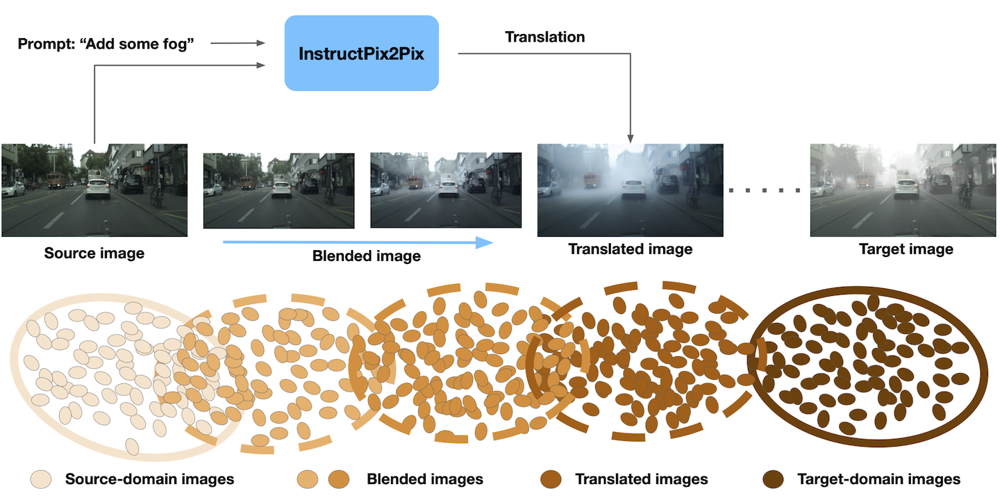

# BlenDA: Domain Adaptive Object Detection through diffusion-based blending

Tzuhsuan Huang*, 
Chen-Che Huang*, 
Chung-Hao Ku, 
[Jun-Cheng Chen](https://www.citi.sinica.edu.tw/pages/pullpull/)

## Environment setup
```
git clone https://github.com/Jason-user/BlenDA
```
```
cd BlenDA/
```
```
conda env create -f environment.yml
```
```
conda activate blenda
```
```
pip install -r requirements.txt
```
```
cd models/ops/
python setup.py build install
```

## Download pre-trained weight
Please refer to [AQT](https://github.com/weii41392/AQT) \
After downloading, put it into the folder called released_weights
```
BlenDA
├── released_weights
|   ├── cityscapes_to_bdd100k_daytime.pth
|   └── cityscapes_to_foggy_cityscapes.pth
```

## Datasets
Please refer to [Ciityscapes](https://www.cityscapes-dataset.com/) and [BDD100K](https://bdd-data.berkeley.edu/) \
To generate city_instruction_cityfoggy and city_instruction_bdd, you can refer to [InstructPix2Pix](https://github.com/timothybrooks/instruct-pix2pix)
```

BlenDA
├── data/
|   ├── bdd_daytime/
|   |   ├── annotations/
|   |   ├── train/
|   |   └──  val/
|   ├── cityscapes/
|   |   ├── annotations/
|   |   └── leftImg8bit/
|   |       ├── train/
|   |       └── val/
|   ├── cityscapes_foggy
|   |   ├── annotations/
|   |   └── leftImg8bit/
|   |       ├── train/
|   |       └── val/
|   ├── city_instruction_cityfoggy/
|   |   ├── train/
|   |   └── val/
|   └── city_instruction_bdd/
|       ├── train/
|       └── val/
```

## Training
```
cd exps/
```
Cityscapes to BDD100K
```
cd c2b/
bash run.sh
```
Cityscapes to Foggy Cityscapes
```
cd c2fc/
bash run.sh
```